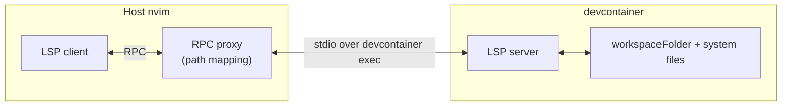

# devcontainer.nvim

> Host Neovim, LSP in the container, no path pain.

Keep Neovim running on the host while LSP servers run inside the
[Dev Container](https://containers.dev). An in-process RPC proxy rewrites
`file://` URIs in JSON-RPC traffic so both sides see correct paths for their
environment. Setup is one line in your `vim.lsp.config`.



## Why this plugin

- **Host editor.** Your nvim config, plugins, fonts, and keybindings stay
  on the host. Nothing extra to install inside the container.
- **Transparent LSP.** `devcontainer.lsp_cmd(argv)` builds a `cmd` value
  for `vim.lsp.config` that spawns the language server inside the
  container and pipes JSON-RPC through a path-rewriting proxy. Same
  buffer, same diagnostics, container-side dependencies.
- **Native `devcontainer.json` parsing.** JSONC + variable substitution,
  not a shell-out. `:checkhealth devcontainer` validates the file before
  you hit a startup error.

## Requirements

- Neovim >= 0.11 (`vim.lsp.config` / `vim.lsp.enable` API).
- [`@devcontainers/cli`](https://github.com/devcontainers/cli) on `$PATH`
  (`npm install -g @devcontainers/cli`).
- A container runtime: `docker` or `podman`.
- A `.devcontainer/devcontainer.json` (or `.devcontainer.json`) in the
  workspace.

## Installation

[lazy.nvim](https://github.com/folke/lazy.nvim):

```lua
{
  "riccardo-enr/devcontainer.nvim",
  cmd = {
    "DevcontainerUp", "DevcontainerDown", "DevcontainerRebuild",
    "DevcontainerExec", "DevcontainerShell", "DevcontainerStatus",
    "DevcontainerLog", "DevcontainerTemplate",
  },
  opts = {},
}
```

## LSP in the container

`require("devcontainer").lsp_cmd(server_argv)` returns a `cmd` value
suitable for `vim.lsp.config`. When the current workspace has a
`devcontainer.json`, it routes the LSP through the in-container server;
otherwise it returns `server_argv` unchanged so nvim spawns the language
server on the host. The same snippet works in both projects.

```lua
local lsp_cmd = require("devcontainer").lsp_cmd

vim.lsp.config("clangd", {
  cmd = lsp_cmd({ "clangd", "--background-index", "--clang-tidy" }),
  filetypes = { "c", "cpp", "objc", "objcpp", "cuda" },
  root_markers = { "compile_commands.json", ".clangd", ".git" },
})

vim.lsp.config("pyright", {
  cmd = lsp_cmd({ "pyright-langserver", "--stdio" }),
  filetypes = { "python" },
  root_markers = { "pyproject.toml", "setup.py", "setup.cfg", ".git" },
})

vim.lsp.enable({ "clangd", "pyright" })
```

Start the container with `:DevcontainerUp` (or set `auto_up = true` to
have the first LSP attach kick it off in the background and queue
outbound JSON-RPC until ready). Container-side paths like `/usr/include/...` show up under the
read-only `docker://<container_id>/...` scheme so go-to-definition
works without bind-mounting system headers.

## Setup options

```lua
require("devcontainer").setup({
  cli = "devcontainer",      -- path to the devcontainer CLI binary
  workspace_folder = nil,    -- override workspace folder (defaults to cwd)
  auto_attach = true,        -- focus the terminal split when commands run
  auto_up = false,           -- implicitly `devcontainer up` on first LSP attach
})
```

| Option | Default | Description |
|---|---|---|
| `cli` | `"devcontainer"` | Path to the `devcontainer` CLI binary. |
| `workspace_folder` | `nil` | Override workspace folder. Defaults to cwd. |
| `auto_attach` | `true` | Focus the terminal split when `:DevcontainerExec` / `:DevcontainerShell` opens. |
| `auto_up` | `false` | If `true`, the first LSP attach triggers `devcontainer up` and queues RPC until ready. If `false`, run `:DevcontainerUp` manually. Set per-project via `.nvim.lua`. |

## Commands

| Command | Description |
|---|---|
| `:DevcontainerUp` | Build and start the devcontainer (async, output streams to the `:DevcontainerLog` buffer). |
| `:DevcontainerRebuild` | Rebuild with `--build-no-cache` and replace the container. |
| `:DevcontainerExec <cmd>` | Run a shell command inside the container. |
| `:DevcontainerShell` | Open an interactive shell inside the container. |
| `:DevcontainerStatus` | Show container id and resolved `workspaceFolder`. |
| `:DevcontainerLog` | Open the streaming log buffer. |
| `:DevcontainerTemplate` | Scaffold `.devcontainer/` from the official templates catalog. |
| `:DevcontainerDown` | (stub) Stop and remove the container. |

## Templates

`:DevcontainerTemplate` pulls the catalog from
[`devcontainers/templates`](https://github.com/devcontainers/templates),
presents it via `vim.ui.select`, and scaffolds the chosen template into
the current workspace's `.devcontainer/`. The catalog and per-template
files are cached on disk under
`stdpath('cache') .. '/devcontainer.nvim/templates/'` with a 24h TTL;
existing `.devcontainer/` files are never overwritten.

## Troubleshooting

Run `:checkhealth devcontainer` first. It probes the CLI, the container
runtime, and `devcontainer.json` parsing, with a distinct message per
failure mode.

### `devcontainer` CLI not on PATH

```
npm install -g @devcontainers/cli
```

If you keep the binary somewhere non-standard, set `cli = "/path/to/devcontainer"`
in `setup()`. Re-run `:checkhealth devcontainer` to confirm.

### Container runtime daemon not reachable

`:checkhealth devcontainer` reports
`container runtime present but 'info' failed; daemon may be down`. Start
the daemon:

```
# docker
sudo systemctl start docker

# podman (rootless)
systemctl --user start podman.socket
```

Verify with `docker info` or `podman info`, then re-run
`:checkhealth devcontainer`.

### `devcontainer.json` parse errors

The parser accepts JSONC (line/block comments, trailing commas on
objects). Trailing commas inside arrays and unquoted keys are still
rejected. On a parse error `:checkhealth devcontainer` prints the file
path and the underlying error; `:DevcontainerStatus` also surfaces the
resolved config path so you can confirm which file is being read.

## Comparison

| | This | [arnaupv/nvim-devcontainer-cli](https://github.com/arnaupv/nvim-devcontainer-cli) | [jedrzejboczar/devcontainers.nvim](https://github.com/jedrzejboczar/devcontainers.nvim) | [erichlf/devcontainer-cli.nvim](https://github.com/erichlf/devcontainer-cli.nvim) |
|---|---|---|---|---|
| nvim on host | Yes | No (installs nvim inside container) | Yes | Yes |
| LSP runs in container | Yes (path-rewriting RPC proxy) | N/A (nvim is in-container) | No | No |
| Native `devcontainer.json` parsing | Yes (JSONC + variable substitution) | No | Partial | No (CLI passthrough) |
| Template scaffolder | Yes (`:DevcontainerTemplate`) | No | No | No |
| `:checkhealth` integration | Yes | No | No | No |

## License

MIT
